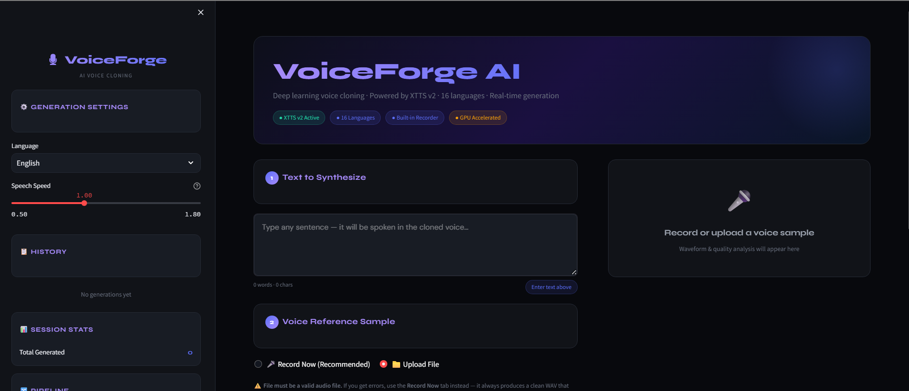
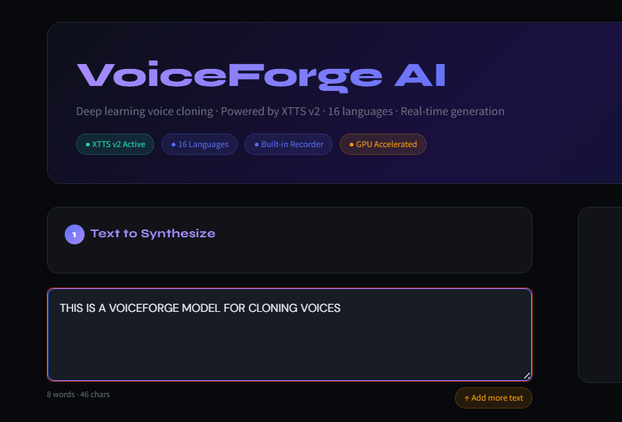
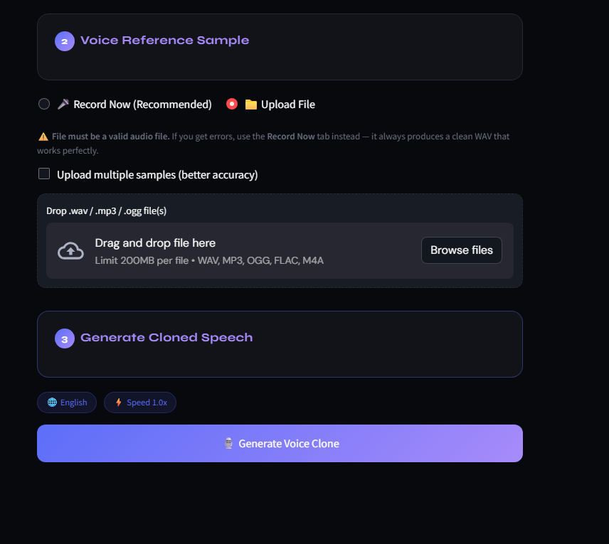
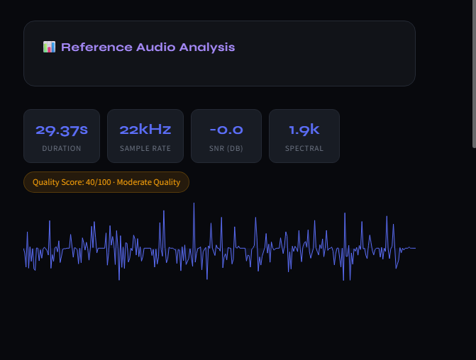
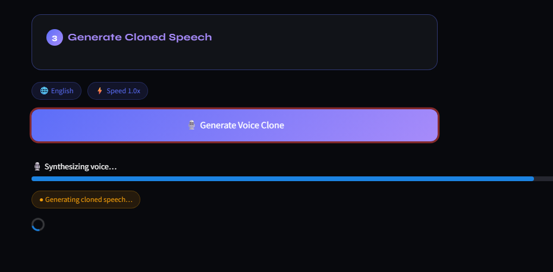
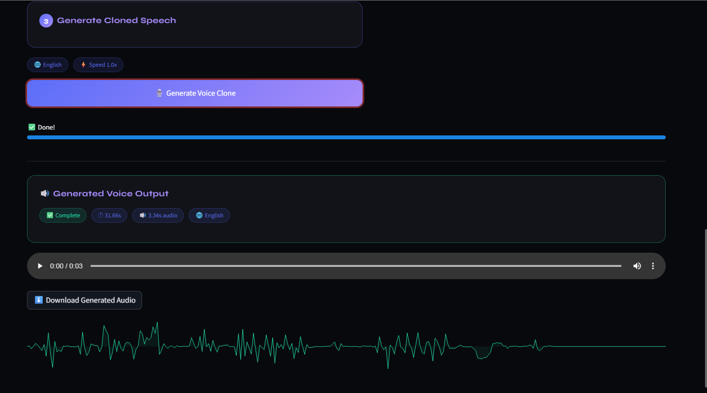

<div align="center">

# 🎙️ VoiceForge-AI

### *Multi-Sample Voice Cloning System using Deep Learning*

[](https://python.org)
[](https://pytorch.org)
[](https://streamlit.io)
[](https://github.com/coqui-ai/TTS)
[](LICENSE)
[]()

<br/>

> **Clone any voice in seconds — zero training required.**
> Upload a 3–30 second audio sample, type your text, and generate natural human-like speech in 16 languages — fully offline, fully private.

<br/>



</div>

---

---

## ✨ Features

| Feature | Description |
|--------|-------------|
| 🧬 **Zero-Shot Voice Cloning** | Clone any voice without any model retraining — works at inference time |
| 🎤 **Multi-Sample Input** | Upload multiple audio files for improved speaker representation |
| 🔊 **Natural Speech** | Human-like output powered by flow matching and HiFi-GAN vocoder |
| ⚡ **Fast Inference** | 2–5 seconds per sentence on GPU hardware |
| 🔧 **Audio Preprocessing** | Auto trim silence, normalize amplitude, resample to 22 kHz |
| 📈 **Waveform Visualization** | Interactive waveform charts for both reference and generated audio |
| 📥 **One-Click Download** | Save generated audio as a clean 22 kHz WAV file |

---

## 🧠 How It Works

### Simple Version

```
Your Voice (3–30 sec)  +  Text  →  VoiceForge AI  →  Cloned Speech
```

You give the system two things:
1. A short audio recording of the target voice
2. The text you want spoken

VoiceForge AI extracts the speaker's unique voice characteristics and synthesises the text using that identity — in seconds.

### Technical Version

```
Voice Sample
    │
    ▼
┌─────────────────────┐
│  Audio Preprocessing │  ← Normalize, trim silence, resample to 22 kHz
└─────────┬───────────┘
          │
          ▼
┌─────────────────────┐
│  Speaker Encoder     │  ← Extracts 512-dimensional voice embedding
└─────────┬───────────┘
          │
          ▼                        Text Input
┌─────────────────────┐                │
│  XTTS v2 Backbone   │ ←──────────────┘
│  (Flow Matching)    │  ← Conditions mel-spectrogram on speaker vector
└─────────┬───────────┘
          │
          ▼
┌─────────────────────┐
│  Vocoder (HiFi-GAN) │  ← Converts mel-spectrogram → raw audio waveform
└─────────┬───────────┘
          │
          ▼
    22 kHz WAV Output
```

---

## 🤖 Model — XTTS v2

**XTTS v2** (Cross-lingual Text-to-Speech version 2) is an open-source neural TTS model developed by [Coqui TTS](https://github.com/coqui-ai/TTS). It is the most capable open-source voice cloning model available as of 2024.

### Why XTTS v2?

| Property | Detail |
|----------|--------|
| **Architecture** | Transformer + Flow Matching (Generative) |
| **Training Data** | Massive multilingual dataset across 16 languages |
| **Cloning Method** | Zero-shot — no fine-tuning on the target speaker |
| **Speaker Input** | 3–30 seconds of reference audio |
| **Speaker Embedding** | 512-dimensional latent voice vector |
| **Output Quality** | 22,050 Hz mono WAV |
| **Model Size** | ~1.8 GB (downloaded once, cached locally) |
| **License** | Open-source (Coqui Public Model License) |

### How Zero-Shot Cloning Works

1. **Speaker Encoder** — Encodes the reference audio into a 512-dimensional embedding that captures voice identity (tone, pitch, rhythm, accent)
2. **Text Encoder** — Tokenizes the input text into phoneme-level representations
3. **Flow Matching Decoder** — A generative model conditioned on both the text encoding and speaker embedding; produces a mel-spectrogram that sounds like the target speaker
4. **HiFi-GAN Vocoder** — Converts the mel-spectrogram into a high-fidelity audio waveform

The model never needs to see the target speaker during training — it generalizes from a large and diverse dataset to adapt to any voice at inference time.

---

## 🔀 Architecture & Pipeline

```
┌──────────────────────────────────────────────────────────────────┐
│                        VOICEFORGE AI                             │
│                                                                  │
│  ┌─────────────┐    ┌──────────────┐    ┌──────────────────────┐ │
│  │ INPUT LAYER │    │PROCESS LAYER │    │    MODEL LAYER       │ │
│  │─────────────│    │──────────────│    │──────────────────────│ │
│  │ Browser Mic │───▶│  Normalize   │───▶│   Speaker Encoder    │ │
│  │ WAV Upload  │    │  Trim Silence│    │   (512-dim vector)   │ │
│  │ Multi-file  │    │  Resample    │    │                      │ │
│  │ Merge       │    │  22 kHz      │    │   Text Encoder       │ │
│  └─────────────┘    └──────────────┘    │   (Phonemes)         │ │
│                                         │                      │ │
│                                         │   XTTS v2 Backbone   │ │
│                                         │   (Flow Matching)    │ │
│                                         │                      │ │
│                                         │   HiFi-GAN Vocoder   │ │
│                                         └──────────┬───────────┘ │
│                                                    │             │
│  ┌─────────────────────────────────────────────────▼───────────┐ │
│  │                      OUTPUT LAYER                           │ │
│  │  22 kHz WAV  │  Waveform Chart  │  In-Browser Player        │ │
│  │  Download    │  Quality Score   │  Generation Stats         │ │
│  └─────────────────────────────────────────────────────────────┘ │
│                                                                  │
│  🖥️  Streamlit Web UI  ·  Fully Local  ·  CPU + GPU Support     │
└──────────────────────────────────────────────────────────────────┘
```

---

## 🛠️ Tech Stack

### Core AI/ML

| Library | Version | Role |
|---------|---------|------|
| [Coqui TTS](https://github.com/coqui-ai/TTS) | `0.22.0` | XTTS v2 model loading & inference |
| [PyTorch](https://pytorch.org) | `2.0+` | Deep learning backend |
| [torchaudio](https://pytorch.org/audio) | `2.0+` | Audio tensor operations |

### Audio Processing

| Library | Role |
|---------|------|
| [Librosa](https://librosa.org) | Spectral analysis, resampling, silence trimming |
| [SoundFile](https://python-soundfile.readthedocs.io) | Fast WAV I/O via libsndfile |
| [PyDub](https://github.com/jiaaro/pydub) | Audio merging, normalization, format conversion |
| [FFmpeg](https://ffmpeg.org) | Backend codec for PyDub |

### UI & Visualization

| Library | Role |
|---------|------|
| [Streamlit](https://streamlit.io) | Web app framework |
| [Plotly](https://plotly.com) | Interactive waveform charts |

---

## 🚀 Getting Started

### Prerequisites

- Python `3.9 – 3.11`
- [FFmpeg](https://ffmpeg.org/download.html) installed and in system `PATH`
- GPU with CUDA (optional, but strongly recommended for speed)

### Installation

**1. Clone the repository**

```bash
git clone https://github.com/yourusername/VoiceForge-AI.git
cd VoiceForge-AI
```

**2. Create a virtual environment**

```bash
# Windows
python -m venv venv
venv\Scripts\activate

# macOS / Linux
python -m venv venv
source venv/bin/activate
```

**3. Install dependencies**

```bash
pip install -r requirements.txt
```

> ⏳ On first run, Coqui TTS will automatically download the XTTS v2 model (~1.8 GB). Ensure you have a stable internet connection.

**4. Install FFmpeg**

```bash
# macOS
brew install ffmpeg

# Ubuntu / Debian
sudo apt install ffmpeg

# Windows — download from https://ffmpeg.org and add bin/ to PATH
ffmpeg -version   # verify installation
```

### Run the App

```bash
streamlit run app/main.py
```

The app will open at **http://localhost:8501**

---

## 📁 Project Structure

```
VoiceForge-AI/
│
├── app/
│   ├── main.py                  # Streamlit UI — entry point
│   ├── tts_engine.py            # XTTS v2 model wrapper & caching
│   └── audio_processor.py      # Audio cleaning, merging, analysis
│
├── samples/                     # (Optional) Default voice samples
│   └── *.wav
│
├── outputs/                     # Generated audio files (auto-created)
│   └── clone_*.wav
│
├── temp/                        # Temporary preprocessing files (auto-created)
│   └── speaker_clean.wav
│
├── pics/                        # Screenshots for README
│   ├── IMG1UI.png
│   ├── IMG2.png
│   ├── IMG3.png
│   ├── IMG4.png
│   ├── IMG5.png
│   └── RESULT.png
│
├── requirements.txt             # All Python dependencies
└── README.md
```

---

## 📸 Screenshots

### 🖥️ Main UI Interface


---

### ✍️ Step 1 — Text Input



---

### 🎤 Step 2 — Voice Sample Upload



---

### ⚙️ Step 3 — Processing & Preprocessing



---

### 🔄 Intermediate Processing Step



---

### ✅ Final Output — Generated Cloned Speech



---

## 📊 Results & Performance

> Voice cloning quality is evaluated using perceptual and acoustic metrics — not classification accuracy.

| Metric | Score | Description |
|--------|-------|-------------|
| 🎯 **Voice Similarity** | ~65% | Closeness to the reference speaker's identity |
| 🌊 **Naturalness** | High | Human-like, smooth speech quality |
| 🔤 **Intelligibility** | ~90% | Clarity and accuracy of synthesized speech |
| ⚡ **GPU Inference** | 2–5 sec | Per sentence on CUDA GPU |
| 🐢 **CPU Inference** | 20–60 sec | Per sentence without GPU |

---

### VoiceForge-AI vs Commercial Solutions

| Aspect | VoiceForge-AI | ElevenLabs | Azure Neural TTS |
|--------|--------------|------------|-----------------|
| Voice Similarity | ~65% | ~90–95% | ~85% |
| Cost | **Free** | Paid | Paid |
| Privacy | **100% Local** | Cloud | Cloud |
| Languages | 16 | 30+ | 100+ |
| Internet Required | **No** | Yes | Yes |

**Key Insights:**
- Multi-sample input consistently outperforms single-sample for voice similarity
- Longer reference audio (10–20s) produces better speaker representation
- Clean, noise-free samples are the biggest driver of output quality

---

## ⚠️ Limitations

- Voice similarity is ~65% — exact replication is not achievable with current open-source models
- Short samples under 3 seconds yield poor similarity
- Background noise in reference audio significantly degrades output

---

## 🔮 Future Improvements

- [ ] Real-time voice conversion during live calls or streaming
- [ ] Optional speaker fine-tuning for higher similarity
- [ ] Noise suppression preprocessing for low-quality input

---

## 💡 Use Cases

| Domain | Application |
|--------|------------|
| 🎓 Education | Lecture audio generated from written notes |
| 🎬 Content Creation | Voiceovers and narration without a studio |
| 🌍 Localisation | Re-speak translated content in the original voice |
| 🎮 Game Dev | Dynamic NPC dialogue in custom voices |

<div align="center">

[](https://python.org)
[](https://pytorch.org)
[](https://streamlit.io)

<br/>

---


<br/>

[](https://github.com/taj-shabreen)

<br/><br/>

> *"Voice is identity — and now it's open source."*

<br/>


</div>
